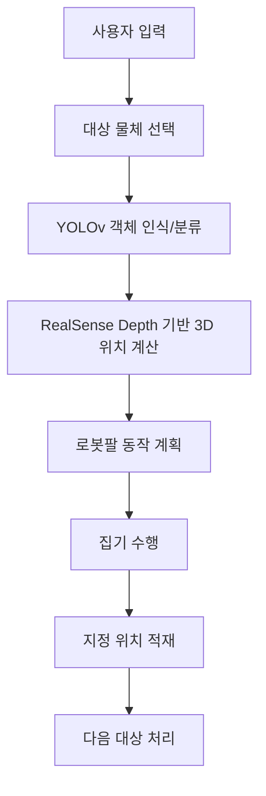

# 물체 인식 기반 로봇팔 자동 적재 시스템

사용자 입력에 따라 물체를 인식·분류하고, 지정된 위치에 순차 적재하는 로봇팔 제어 시스템입니다.

## 프로젝트 기간
- 2026-02-06 ~ 2026-02-10

## 배경
물류 및 제조 현장에서는 작업자가 물체를 지정하고 로봇이 반복적인 집기·적재 작업을 수행하는 사용자 개입형 로봇 시스템이 요구됩니다. 이에 따라 사용자 입력을 반영하고 Depth 기반 위치 정보를 활용해 보다 안정적인 집기·적재 작업을 수행하는 로봇 시스템을 구현하고자 본 주제를 선정했습니다.

## 목표
- YOLOv 모델로 물체를 인식 및 분류
- RealSense Depth 정보를 활용해 물체의 3차원 위치를 계산
- 계산된 위치 정보를 로봇의 인지 및 동작 결정에 활용

## 주요 기능
- 사용자 입력 기반 대상 물체 선택
- YOLOv 기반 객체 인식 및 분류
- RealSense Depth 기반 3차원 위치 추정
- 로봇팔 집기 및 지정 위치 적재

## 기술 스택
- 개발 환경
  - OS: Ubuntu 22.04 (Jammy)
  - ROS 2: Humble
  - Build tool: colcon
  - Language: Python
- 비전
  - Camera: Intel RealSense
  - Object Detection: YOLOv (YOLOv5)
  - Vision Library: OpenCV
- 로봇 제어
  - Robot: Doosan DSR
  - ROS2 Package: doosan-robot2

## 프로젝트 구조
- `yolo_rs/`: ROS2 Python 패키지 소스
- `resource/`: ROS2 패키지 리소스
- `test/`: 테스트 코드
- `package.xml`: ROS2 패키지 메타데이터
- `setup.py`, `setup.cfg`: Python 패키지 설정

## 실행 방법
1. 워크스페이스 루트로 이동한 뒤 빌드합니다.

```bash
colcon build --symlink-install
```

2. 환경을 로드합니다.

```bash
source install/setup.bash
```

3. YOLO 노드를 실행합니다.

```bash
ros2 run yolo_rs yolo_node
```

4. 로봇 제어 노드를 실행합니다.

```bash
ros2 run yolo_rs robot_node
```

## 프로젝트 Flow (Mermaid)

