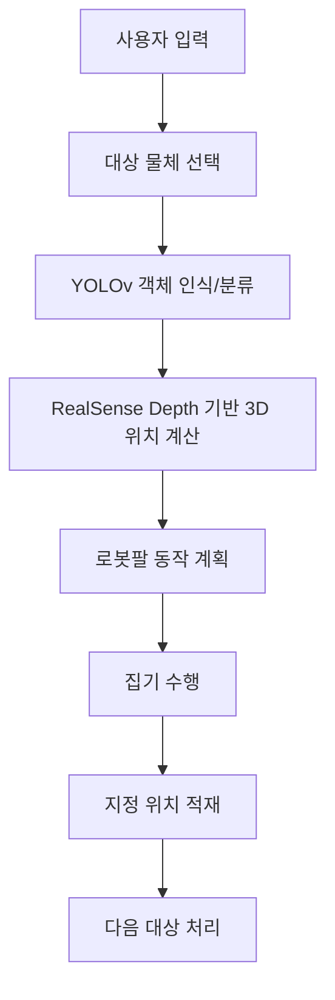

# 📌 Main Thema
**사용자 입력에 따라 물체를 인식·분류하고, 지정된 위치에 순차 적재하는 로봇팔 제어 시스템입니다.**


---
---

# 👨‍👩‍👧‍👦 Team Introduction
<table align="center">
  <tr>
    <td align="center" width="180">
      <b>손주영</b>
      <br>비전/인식: YOLO 학습·추론, 클래스 정의, 성능 튜닝<br>
      <br>Depth/좌표: RealSense 연동, Depth 기반 3D 좌표 계산<br>
    </td>
    <td align="center" width="180">
      <b>손영석</b>
      <br>로봇 제어: DSR 제어, 경로 계획, 집기·적재 동작 구현<br>
      <br>통합/시스템: ROS2 노드 통합, 토픽/서비스 설계, 데모 시나리오 구성<br>
    </td>
    <td align="center" width="180">
      <b>김기영(조장)</b><br>
      통합/시스템: ROS2 노드 통합, 토픽/서비스 설계, 데모 시나리오 구성<br>
    </td>
    <td align="center" width="180">
      <b>김상전</b><br>
      로봇 제어: DSR 제어
    </td>
  </tr>
</table>

---
---

# 🛠️ Stacks
### Environment & Ops


### Vision


### Robot Control


---
---


# 프로젝트 개요
## 1. 배경
물류 및 제조 현장에서는 작업자가 물체를 지정하고 로봇이 반복적인 집기·적재 작업을 수행하는 사용자 개입형 로봇 시스템이 요구됩니다. 이에 따라 사용자 입력을 반영하고 Depth 기반 위치 정보를 활용해 보다 안정적인 집기·적재 작업을 수행하는 로봇 시스템을 구현하고자 본 주제를 선정했습니다.

## 2. 목표
- YOLOv8 모델로 물체를 인식 및 분류
- RealSense Depth 정보를 활용해 물체의 3차원 위치를 계산
- 계산된 위치 정보를 로봇의 인지 및 동작 결정에 활용

## 3. 주요 기능
- 사용자 입력 기반 대상 물체 선택
- YOLOv 기반 객체 인식 및 분류
- RealSense Depth 기반 3차원 위치 추정
- 로봇팔 집기 및 지정 위치 적재

---
---

# 프로젝트 흐름도

## Flow Chart

## System Architecture(rqt_graph)


---
---

# 프로젝트 구조
```
yolo_rs/
├── README.md
├── image/                       # 데모 이미지
├── resource/                    # ROS2 패키지 리소스
├── test/                        # 테스트 코드
├── yolo_rs/                     # ROS2 Python 패키지 소스
├── package.xml                  # ROS2 패키지 메타데이터
├── setup.py                     # 패키지 설정
└── setup.cfg                    # 패키지 설정
```

---
---

# 기술 구성
| 구성 요소 | 역할 |
| --- | --- |
| 사용자 입력 | 대상 물체 선택 및 작업 트리거 |
| 비전 인식 (YOLOv8 v8.10) | 객체 검출/분류 및 클래스 결정 |
| Depth 처리 (RealSense) | Depth 기반 3D 좌표 계산 및 캘리브레이션 |
| 로봇 제어 (DSR) | 경로 계획, 집기/적재 동작 실행 |
| ROS2 통합 | 노드 분리, 토픽/서비스로 데이터 교환 |
| 빌드/실행 | `colcon` 빌드 및 런타임 환경 구성 |


## 데이터 파이프라인
- 데이터 수집: [snack Object Detection Dataset by education](https://universe.roboflow.com/education-oqzdo/snack-eej94) Roboflow 데이터셋 다운로드
- 전처리: train/valid/test 분할(80:10:10), 라벨 검수
- 학습: YOLOv8 학습 설정(eochs: 50, batch: 16)
- 결과: `best.pt` 저장 및 추론 적용


---
---

# 실행 방법

```bash
# 워크스페이스 루트에서 빌드
colcon build --symlink-install

# 환경을 로드합니다.
source install/setup.bash

#RealSense 카메라를 실행합니다.
ros2 launch realsense2_camera rs_camera.launch.py

# YOLO 노드를 실행합니다.
ros2 run yolo_rs yolo_node


# 로봇 제어 노드를 실행합니다.
ros2 run yolo_rs robot_node
```
